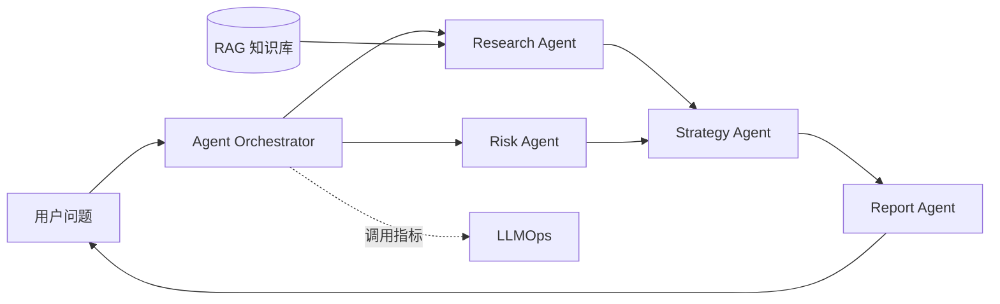

# Finance-Agent：基于 LLM 的多智能体金融分析系统

一个可本地复现的智能投研 Demo：通过投研、风控、策略与报告 Agent 协作，将金融知识检索、风险识别和投资观点整合成结构化报告。项目默认使用内置样例数据，无 API Key 也能完整演示；配置 OpenAI 兼容接口后可启用真实大模型。

> 本项目仅用于教学与工程演示，不构成任何投资建议。演示行情均为静态样例，不代表实时市场数据。

## 核心能力

- 多 Agent 协作：并行生成投研分析与风险评估，再汇总投资策略和报告。
- 轻量 RAG：对内置金融知识片段进行中文关键词检索，并返回可核验来源。
- LLM 可选接入：支持 DashScope、DeepSeek、OpenAI 等兼容 Chat Completions 的服务。
- LLMOps：记录请求量、成功率、Token 用量与平均延迟。
- 可视化前端：智能分析、市场看板、知识库和运行监控四个页面。
- 双模式运行：本地开发或 Docker Compose 一键启动。

## 系统流程



## 3 分钟复现

环境要求：Python 3.10+、Node.js 18+。

```bash
git clone <your-repository-url>
cd Finance-Agent

# 终端 1：后端
python -m venv .venv
# Windows: .venv\Scripts\activate
# macOS/Linux: source .venv/bin/activate
pip install -r backend/requirements.txt
uvicorn app.main:app --app-dir backend --reload

# 终端 2：前端
cd frontend
npm install
npm run dev
```

打开 <http://localhost:5173>。API 文档位于 <http://localhost:8000/docs>。

也可以只运行后端演示：

```bash
pip install -r backend/requirements.txt
python demo/run_demo.py
```

### 启用真实 LLM（可选）

复制 `.env.example` 为 `.env`，填写 `LLM_API_KEY`、`LLM_API_BASE` 和 `LLM_MODEL`。密钥为空时系统自动使用确定性的本地演示结果，便于评审者复现。

## Docker 启动

```bash
docker compose up --build
```

访问 <http://localhost:3000>；停止服务使用 `docker compose down`。

## API 示例

```bash
curl -X POST http://localhost:8000/api/v1/agents/analyze \
  -H "Content-Type: application/json" \
  -d '{"query":"分析贵州茅台的基本面和主要风险","stock_code":"600519"}'
```

响应包含 `research`、`risk`、`strategy`、`report`、`sources` 与 `trace_id`，便于展示 Agent 的中间产物与检索依据。

## 项目结构

```text
Finance-Agent/
├── backend/app/          # FastAPI、Agent、RAG、LLM 与监控
├── frontend/src/         # Vue 3 单页应用
├── demo/run_demo.py      # 无前端复现入口
├── tests/                # 后端 API 与编排测试
├── docs/                 # 原始需求文档与实现说明
├── docker-compose.yml
├── environment.yml
└── README.md
```

## 数据说明

仓库不分发受限金融数据。默认样例包含 4 只股票的静态展示字段（代码、名称、价格、涨跌幅）以及少量公开常识型知识片段。真实项目中可在 `backend/app/services/market.py` 替换为 Wind、Tushare 或合规行情源。

| 字段 | 含义 | Demo 来源 |
| --- | --- | --- |
| code | 股票代码 | 静态样例 |
| name | 股票简称 | 静态样例 |
| price | 示例价格 | 静态样例，非实时 |
| change_pct | 示例涨跌幅 | 静态样例，非实时 |

## 验证

```bash
pip install -r backend/requirements-dev.txt
pytest -q
cd frontend && npm run build
```

## 设计取舍与扩展

当前版本刻意减少基础设施依赖，以保证代码审阅与首次复现。`KnowledgeBase`、`MetricsStore` 和市场数据服务均通过独立模块隔离，后续可分别替换为 Chroma/Milvus、Prometheus/PostgreSQL 和实时行情源；生产环境还应补充认证、限流、持久化、数据授权和提示词安全策略。

## 参考

- FastAPI、Vue 3、Vite 官方文档
- 原项目需求与架构说明见 `docs/project-spec.pdf`

